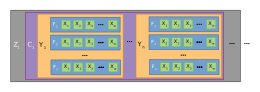

# Contents
* [Introduction](#introduction)
* [Range Coding (RAC)](#range-coding-rac)
* [Primary Header](#primary-header)
* [Transformations](#transformations)
    * [Plane Transformations](#plane-transformations)
        * [ChannelCompact](#0-channelcompact)
        * [YCoCg](#1-ycocg)
        * [Reserved Slot](#2-reserved-slot)
        * [PermutePlanes](#3-permuteplanes)
        * [Bounds](#4-bounds)
        * [PaletteAlpha](#5-palettealpha)
        * [Palette](#6-palette)
        * [ColorBuckets](#7-colorbuckets)
        * [Reserved Slot](#8-reserved-slot)
        * [Reserved Slot](#9-reserved-slot)
    * [Frame Transformations](#frame-transformations)
        * [DuplicateFrame](#10-duplicateframe)
        * [FrameShape](#10-frameshape)
        * [FrameLookback](#10-framelookback)
* [Interlaced Encoding and Non Interlaced Encoding](#interlaced-encoding-and-non-interlaced-encoding)
* [MANIAC Probability Model and MANIAC Trees](#maniac-probability-model-and-maniac-trees)
* [Pixeldata Organisation](#pixeldata-organisation)
  * [Non Interlaced](#non-interlaced)
  * [Interlaced](#interlaced)
* [Pixel Prediction Algorithm](#pixel-predition-algorithm)
  * [Non Interlaced](#non-interlaced-1)
  * [Interlaced](#interlaced-1)
* [Checksum](#checksum)


# Introduction

[Free Lossless Image Format][flif-web], or FLIF is the precursor to
[JPEG XL][jpeg-xl-web] and [FUIF][fuif-web]. It claims to have a higher level of
compression or lower file size than conventional lossless image formats like
PNG, Lossless JPEG 2000, etc. FLIF and FUIF development has been stopped in
favour of JPEG XL.

FLIF uses a combination of arithmetic coding techniques and probability models,
as well as transformation of image data to increase redundancy in order to
compress the data better.

One of the peculiar features of FLIF is that image data is not stored
frame-by-frame, but rather stored channel by channel, then row by row, then
frame by frame, and then each individual pixel. This is described in detail
later [here](#pixeldata-organisation).

# Range Coding (RAC)

FLIF uses Range Coding, a subset of [Arithmetic Coding][arcod] for encoding the
data. There is virtually no difference between range coding and arithmetic
coding aside from the fact that:

1. Integer arithmetic is always used, although almost all modern arithmetic
   coders use integer arithmetic.
2. When the difference between the lower bound and the upper bound, i.e. the
   range becomes too small, the range is increased by shifts of 8 bits, or a
   byte (`2 ** 8`) or other arbitrary values instead of simply doubling the
   range value (`2 ** 1`) [[1]][overhead]. The byte that has been shifted is
   pushed out to the output stream. This is called *renormalisation*.

FLIF's range coder (RAC) works in mostly the same way as described above. The
RAC's upper limit is `2 ** 24` or `1 << 24` and the lower limit is `2 ** 16`
or `1 << 16`. Two values are used, `low` and `range` which represent the lower
bound and the difference between the lower and upper bounds respectively.

We define 4 constants that will be used in the following sections based on the
above information:

```
MIN_RANGE_BITS = 16
MIN_RANGE = 1 << MIN_RANGE_BITS
MAX_RANGE_BITS = 24
MAX_RANGE = 1 << MAX_RANGE_BITS
```

## Probability Values or Chance

FLIF uses probability values that range between `1` and `4095` (inclusive), and
hence require 12 bits to represent `(2 ** 0, (2 ** 12 - 1))`.

## Range Encoding

The range encoder is initialised as follows:

```
encoder_init(rac):
    rac.range       = MAX_RANGE;
    rac.low         = 0;
    rac.delay_byte  = -1; // This indicates that we are processing the first bit
    rac.delay_count = 0;
```

The algorithm used to encode a particular bit `bit` with chance `chance` is:

```
encode_bit(rac, bit, chance):
    if bit == 1:
        rac.low   = rac.low + rac.range - chance
        rac.range = chance
    else:
        rac.range = rac.range - chance
```

Renormalisation of the range is done to ensure that precision of the range coder
is within the acceptable limits. This is run before each decode or encode cycle.
The range is renormalised by:

```
encoder_renorm(rac):
    int byte;
    while rac.range <= MIN_RANGE:
        byte = rac.low >> MIN_RANGE_BITS

        /* First bit condition */
        if rac.delayed_byte < 0:
            rac.delayed_byte = byte

        /* No overflow */
        else if ((rac.low + rac.range) >> 8) < MIN_RANGE:
            output_byte(rac.delayed_byte)
            while rac.delayed_count > 0:
                output_byte(0xFF)
                rac.delayed_count = rac.delayed_count - 1
            rac.delayed_byte = byte

        /* Overflow */
        else (rc->low >> 8) >= MIN_RANGE:
            output_byte(rac.delayed_byte + 1)
            while rac.delayed_count > 0:
                output_byte(0x00)
                rac.delayed_count = rac.delayed_count - 1
            rac.delayed_byte = byte & 0xFF

        /* Delayed Byte or Straddle condition */
        else:
            rac.delayed_count = rac.delayed_count + 1

        /* Shift while keeping last bit 0 */
        rac.low = (rac.low & (MIN_RANGE - 1)) << 8
        /* Shift range */
        rac.range = rac.range << 8
```

Uptil now, we are not exactly sure what happens inside the renormalisation loop
logic's overflow and non overflow conditions, aside from their analogusness to
the interval being in the fist half and the second half of the whole range from
0 to 1 in arithmetic coding. Further investigation is needed.

And finally, the range coder is flushed and ended by doing the following, such
that all remaining bits describing the data are 'flushed' out:

```
encoder_flush(rac):
    rac.low += MIN_RANGE - 1;
    for i = 1 to 4:
        rac.range = MIN_RANGE - 1;
        renorm(rac)
```

## Range Decoding

The decoder is initialised as follows. The the lower bound of the range, `low`
is filled with bytes from the input stream.

```
decoder_init(rac):
    rac.low = 0
    rac.range = MIN_RANGE
    int r = MIN_RANGE
    while r > 1:
        rac.low = rac.low << 8
        low = low | input_byte()
        r = r >> 8
```

To decode a particular bit with chance `chance`, the following is done:

```
decode_bit(rac, chance):
    if rac.low >= rac.range - chance:
        rac.low = rac.low - rac.range - chance
        rac.range = chance
        return 1 // 1 is the bit.
    else
        rac.range = rac.range - chance
        return 0 // 0 is the bit.
```

The renormalisation loop is as follows:

```
decoder_renorm():
    while rac.range < MIN_RANGE:
        rac.low = rac.low << 8
        rac.range = rac.range << 8
        rac.low = rac.low | input_byte()
```

Since the data we ask to be extracted to the stream is the only data we require,
there is no need to detect end of stream and hence there is no decoder flushing
routine present or used.

## Probability Models and Chance Table

FLIF uses a variable probability model for updating the probability values of
each symbol that occurs. 

# Primary Header


# Metadata

# Secondary Header

# Transformations

# Ranges

## Plane Transformations

Plane transformations modify the contents of the *planes* of each given frame,
and are applied to all visible frames.

### 0. ChannelCompact
### 1. YCoCg

### 2. Reserved Slot

Reserved slot for future use.

### 3. PermutePlanes
### 4. Bounds
### 5. PaletteAlpha
### 6. Palette
### 7. ColorBuckets
### 8. Reserved Slot

Reserved slot for future use.

### 9. Reserved Slot

Reserved slot for future use.

## Frame Transformations

Frame transformations on the other hand modify the frames *themselves*. These
can edit the shape of a frame, recognise duplicates and then point to the
duplicate frame instead of storing its data, and finally perform a type of
"delta" compression by performing "look-backs" to previous frames.

### 10. DuplicateFrame
### 11. FrameShape
### 12. FrameLookback

# MANIAC Probability Model and MANIAC Trees

# Interlaced Encoding and Non Interlaced Encoding


Sample text

-------------------------------------------------------------------------------

# Pixeldata Organisation
## Non Interlaced


## Interlaced




# Pixel Predition Algorithm

## Non Interlaced

## Interlaced

# Checksum


[flif-web]:  https://flif.info/
[jpeg-xl-web]:  https://jpeg.org/jpegxl/index.html
[fuif-web]:  https://github.com/cloudinary/fuif
[arcod]: https://en.wikipedia.org/wiki/Arithmetic_coding
[overhead]: https://web.archive.org/web/20191008085240/https://people.xiph.org/~tterribe/notes/range.html
